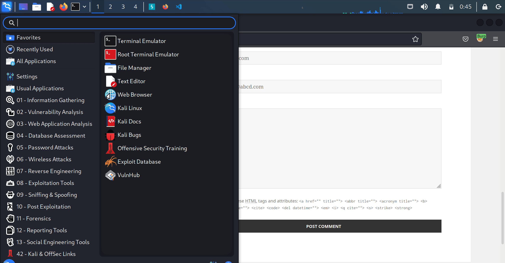
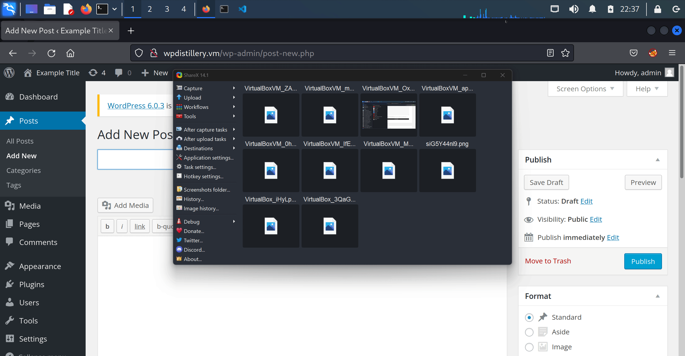

# Project 7 - WordPress Pen Testing

Time spent: **8** hours spent in total

> Objective: Find, analyze, recreate, and document **five vulnerabilities** affecting an old version of WordPress

## Pen Testing Report

### 1. Unauthenticated Stored Cross Site Scripting (CVE-2015-3440)

- [ ] Summary: 
  If the comment text is long enough, it will be truncated when inserted in the database which results in malformed HTML generated on the page. The MySQL TEXT type size limit is 64 kilobytes, so the comment has to be quite long. The attacker can supply any attributes in the allowed HTML tags which leads to the XSS alert.
  - Vulnerability types: Cross Site Scripting (XSS)
  - Tested in version: 4.2
  - Fixed in version: 4.2.1
- [ ] GIF Walkthrough: 

- [ ] Steps to recreate: 
  Create a comment with the following HTML payload:
  ```html
  <a title='x onmouseover=alert(unescape(/hello%20world/.source)) style=position:absolute;left:0;top:0;width:5000px;height:5000px  AAAAAAAAAAAA...[64 kb]..AAA'></a>
  ```
- [ ] Affected source code:
  - None, as this vulerability is dependent upon the MySQL TEXT type size limit.
  
### 2. Authenticated Stored Cross-Site Scripting via Image Filename (CVE-2016-7168)

- [ ] Summary: 
  An attacker can inject arbitrary web script or HTML by tricking an administrator into uploading an image file that has a maliciously crafter filename. 
  - Vulnerability types: Cross Site Scripting (XSS)
  - Tested in version: 4.2
  - Fixed in version: 4.2.10
- [ ] GIF Walkthrough: 
  
- [ ] Steps to recreate: 
  Create a malicious image with the following payload in the filename: 
  ```html
  test.jpg
  ```
  Send the malicious image to the admin using social engineering. When the admin creates a new post using the image as an attachment page, the XSS alert will trigger whenever someone views the post and clicks on the post title.
- [ ] Affected source code:
  - [https://github.com/WordPress/WordPress/commit/c9e60dab176635d4bfaaf431c0ea891e4726d6e0](https://github.com/WordPress/WordPress/commit/c9e60dab176635d4bfaaf431c0ea891e4726d6e0)

### 3. (Required) Vulnerability Name or ID

- [ ] Summary: 
  - Vulnerability types:
  - Tested in version:
  - Fixed in version: 
- [ ] GIF Walkthrough: 
- [ ] Steps to recreate: 
- [ ] Affected source code:
  - [Link 1](https://core.trac.wordpress.org/browser/tags/version/src/source_file.php)

## Assets

List any additional assets, such as scripts or files

## Resources

- [WordPress Source Browser](https://core.trac.wordpress.org/browser/)
- [WordPress Developer Reference](https://developer.wordpress.org/reference/)

GIFs created with [ShareX](https://getsharex.com/).
<!-- Recommended GIF Tools:
[Kap](https://getkap.co/) for macOS
[ScreenToGif](https://www.screentogif.com/) for Windows
[peek](https://github.com/phw/peek) for Linux. -->

## Notes

Describe any challenges encountered while doing the work

## License

    Copyright [2022] [Kushan Singh]

    Licensed under the Apache License, Version 2.0 (the "License");
    you may not use this file except in compliance with the License.
    You may obtain a copy of the License at

        http://www.apache.org/licenses/LICENSE-2.0

    Unless required by applicable law or agreed to in writing, software
    distributed under the License is distributed on an "AS IS" BASIS,
    WITHOUT WARRANTIES OR CONDITIONS OF ANY KIND, either express or implied.
    See the License for the specific language governing permissions and
    limitations under the License.
